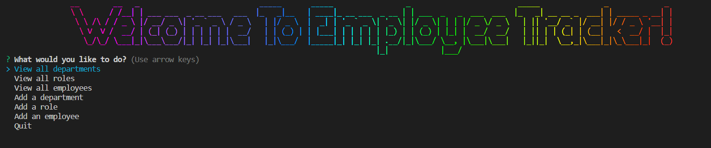
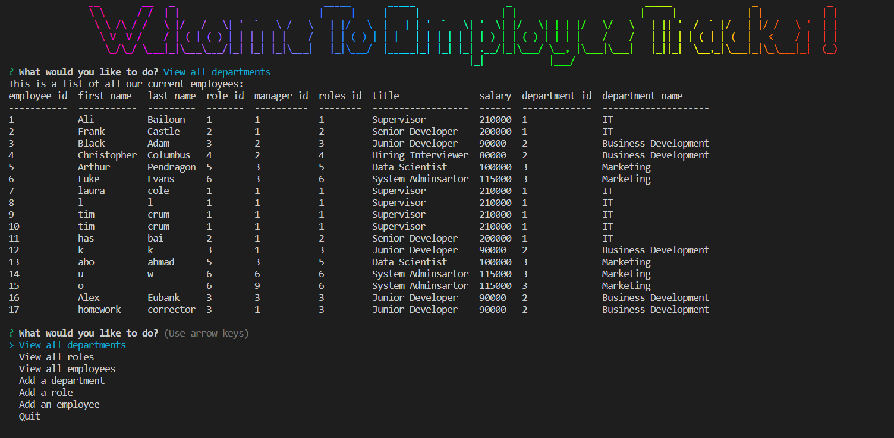

# Employee-Tracker

# Description:

## Welcome to a professional employee tracking application that uses inquirer.js to interact with a user via the command line, MySQL2 in order to retrieve and recieve information from the database and console.table to print MySQL rows into the console.

# How to use:

## Simply run node index.js into the terminal after cloning the repo and answer all the questions that follow

# Link to the repo:

## https://github.com/AliBailoun/Employee-Tracker

# Link to the youtube video:

## https://youtu.be/YhDkbBGGyJU

### Please note that the video is only accessible by this link and cannot be watched by any member of the public (avoiding copyright claims with trilogy education).

# A couple screenshots showing a small part of what the app can do:
#
#
#

#
#
#

#
#
#
